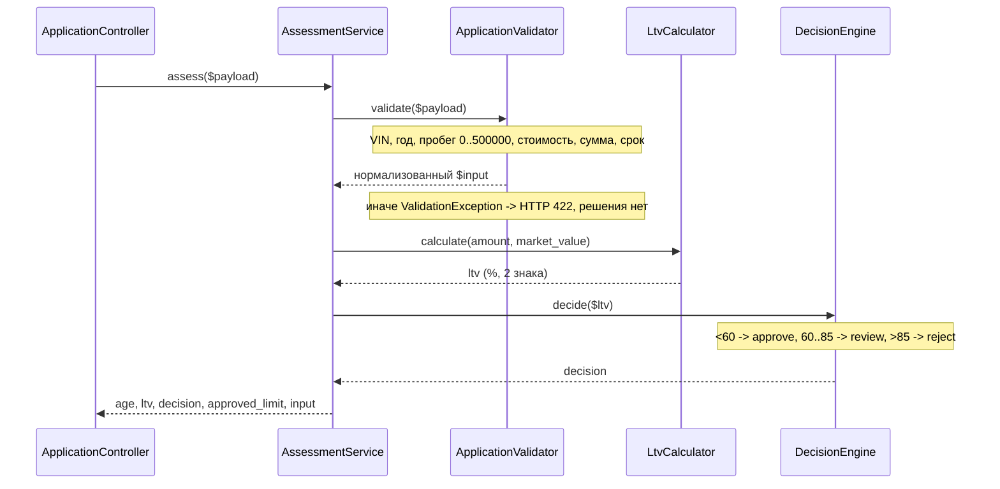

# Карта кода: как считается решение approve / review / reject

Разбор по `backend/src/Domain/` и `backend/config/rules.php`. Только факты из кода.

## 1. Как считается решение: файлы и порядок вызовов

### Участники

| Файл | Роль |
|---|---|
| `backend/config/rules.php` | Справочник всех порогов (числа не хардкодятся в коде) |
| `backend/src/AppFactory.php` (строки 27–39) | Сборка: `require rules.php`, конструирует `VinValidator($rules['vin'])`, `ApplicationValidator($rules, …)`, `LtvCalculator()`, `DecisionEngine($rules['ltv'])`, `AssessmentService(…)` |
| `backend/src/Domain/ApplicationValidator.php` | Валидация входа, нормализация |
| `backend/src/Domain/VinValidator.php` | Формат VIN |
| `backend/src/Domain/VehicleAge.php` | Возраст авто |
| `backend/src/Domain/LtvCalculator.php` | LTV в процентах |
| `backend/src/Domain/DecisionEngine.php` | approve / review / reject |
| `backend/src/Domain/AssessmentService.php` | Оркестратор: валидация → LTV → решение |
| `backend/src/Domain/ValidationException.php` | Исключение с массивом ошибок `поле => сообщение` |

Точка входа — `ApplicationController::create()` / `::ltv()` (вне Domain) вызывают `AssessmentService::assess($payload)`.

### Порядок внутри `AssessmentService::assess()` (строки 28–42)

1. **`ApplicationValidator::validate($payload)`** (строка 30). Собирает ошибки в массив и в конце бросает `ValidationException`, если хоть одна есть — тогда решение **вообще не вычисляется**, контроллер вернёт HTTP 422 `{"errors": …}`. Проверки по порядку:
   - VIN через `VinValidator::isValid()`: 17 символов (`vin.length`), только A–Z и 0–9, без `I`, `O`, `Q` (`vin.forbidden_chars`);
   - год: не раньше 1990 (`vehicle.min_year`), не из будущего (`age < 0`, возраст через `VehicleAge::inYears()`), не старше 20 лет (`vehicle.max_age_years`);
   - **пробег: `0 ≤ mileage ≤ 500 000`** (`vehicle.max_mileage_km`) — подробнее в п. 3;
   - `market_value > 0`;
   - сумма 50 000–2 000 000 (`amount.min/max`);
   - срок 3–48 месяцев (`term.min_months/max_months`).

   При успехе возвращает нормализованный массив `['vin', 'year', 'mileage', 'market_value', 'requested_amount', 'term_months']`.

2. **`LtvCalculator::calculate(requested_amount, market_value)`** (строка 32): защитно проверяет, что оба значения `> 0` (фактически это уже гарантировано валидатором), возвращает `round(сумма / стоимость * 100, 2)` — проценты с двумя знаками.

3. **`DecisionEngine::decide($ltv)`** (строка 33). Пороги приходят в конструктор из `rules['ltv']` (`approve_max = 60.0`, `review_max = 85.0`). Логика по коду (строки 32–40):
   - `$ltv < 60.0` → `approve`;
   - `60.0 <= $ltv <= 85.0` → `review`;
   - `$ltv > 85.0` → `reject`.

   ⚠️ Нюанс: докблок `DecisionEngine` (строки 10–12) и комментарий в `rules.php` (строки 39–41) пишут `LTV <= approve_max -> approve`, но в коде сравнение **строгое** `<`. При LTV ровно 60.0 код вернёт `review`, а не `approve` — расхождение комментария с кодом.

4. **Формирование результата**: `vehicle_age` (ещё раз `VehicleAge::inYears($input['year'])`), `ltv`, `decision`, `approved_limit` = `requested_amount` при `approve`, иначе `0` (строка 39), плюс исходный `input`.



Справочник `rules['ltv_by_age']` загружается, но **нигде не используется** — по комментариям это задача LOAN-12. Справочник `rules['vehicle']['max_mileage_km']` используется только валидатором.

## 2. Куда встанет правило «пробег ≤ 400 000 км, иначе review»

Ключевой архитектурный факт: сейчас решение — **чистая функция от LTV**. `DecisionEngine::decide(float $ltv)` (строка 30) принимает только LTV; пробег туда не передаётся.

**Место — `AssessmentService::assess()`, сразу после строки 33** (`$decision = $this->decisionEngine->decide($ltv);`):

```php
if ($input['mileage'] > $порог_из_rules) {
    $decision = DecisionEngine::REVIEW;
}
```

`assess()` — единственное место, где одновременно доступны и решение, и пробег. Альтернатива — расширить `DecisionEngine::decide(float $ltv)` вторым аргументом `int $mileage` и прокинуть порог в его конструктор, но это смена контракта класса, чей докблок — «решение на основании LTV». По конвенции проекта порог 400 000 нельзя хардкодить: нужен новый ключ в `rules.php` в секции `vehicle` (рядом с `max_mileage_km`).

**Что уже есть:**

- нормализованный `mileage` (int, уже проверенный на 0–500 000) — в `$input['mileage']` внутри `assess()`;
- константа `DecisionEngine::REVIEW`;
- место в `rules.php` для нового порога;
- рабочая зона правила определена валидацией: оно реально срабатывает для диапазона **400 001–500 000 км**, всё выше отсекается ещё до решения (строка 44 валидатора).

**Чего не хватает:**

- порога 400 000 в `rules.php` — **нет**. `max_mileage_km = 500000` — другая по смыслу вещь: жёсткая граница валидации (за пределами — 422-ошибка, заявка не оценивается), а не условие для review;
- доступа к порогу в месте решения: у `AssessmentService` в конструкторе (строки 16–22) нет `$rules` — только validator, ltvCalculator, decisionEngine, vehicleAge. Порог придётся инжектить (новый аргумент конструктора `AssessmentService` или `DecisionEngine`) и поправить сборку в `AppFactory::create()` (строки 30–39);
- механизма комбинирования правил — **нет**: в коде нет ни одного правила, корректирующего решение после LTV. Приоритеты не определены нигде, их нужно задать при внедрении, например: LTV-`reject` при большом пробеге остаётся `reject` (пробег не «повышает» решение), LTV-`approve` понижается до `review`. В коде этого нет.

**Побочный эффект из существующего кода:** строка 39 — `approved_limit` равен сумме только при `decision === APPROVE`. Заявка с пробегом 400 001+, которая по LTV прошла бы в approve, получит и `review`, и `approved_limit = 0`.

## 3. Что в коде уже сейчас проверяется про пробег

- **`ApplicationValidator::validate()`, строки 43–46**: `$mileage = (int)($payload['mileage'] ?? -1)`; ошибка, если `mileage < 0` **или** `mileage > 500 000` (`rules['vehicle']['max_mileage_km']`), сообщение «Пробег от 0 до 500000 км» уходит в `ValidationException` → HTTP 422. Это валидация входа, не решение `review`/`reject` — заявку с пробегом 600 000 сервис не «отклоняет», а не принимает к оценке.
- Нормализованный `mileage` возвращается в `$input` (строка 78), попадает в ответ `assess()` под ключом `input` и сохраняется в БД через `ApplicationRepository::save()` (колонка `mileage_km`).
- Участие пробега в расчёте LTV, в решении или в лимите — **нет**. В `DecisionEngine`, `LtvCalculator`, `VehicleAge` пробег не упоминается. `ltv_by_age` — про возраст, не про пробег, и к тому же пока не используется. Других проверок пробега — **нет**.
